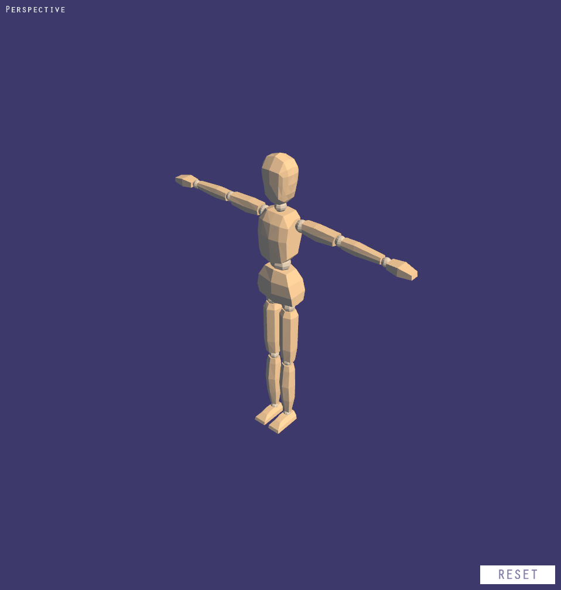
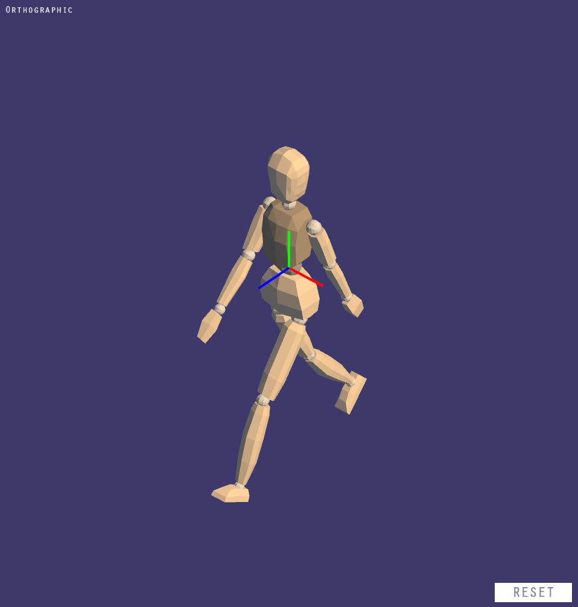

# Posable Figure

A virtual wooden mannequin for artists. Can be posed in various ways. For Windows, written in C++.

## Controls
In Posable Figure, camera is an arc ball and can be rotated by __clicking and dragging with right mouse button__. It also can be zoomed in and out with __mouse scroll wheel__. Individual limbs and their parts can be selected with the __left mouse button__. Upon selecting a body part, the gizmo will appear, which lets you choose the axis around which you would like to rotate the selected body part. __By selecting the axis and moving the mouse left or right__ you can rotate the selected body part. After it was rotated, __left mouse button__ will confirm the rotation and __right mouse button__ will cancel the rotation and reset to what it was before.

__RESET button__ at the bottom right corner of the window can be used to reset the rotated limbs and the whole pose to the default T-pose.

### Additional keybindings
Posable Figure has Blender-like camera keybindings:
* __numpad 1__: show the front view
* __numpad 3__: show the right view
* __numpad 7__: show the top view
* __numpad 5__: switch between orthographic and perspective projections

The program also has Blender-like axis selection keybindings. After the body part was selected, pressing __x__, __y__ or __z__ on your keyboard will choose the respective axis of rotation. The axes, of course, are color coded and can be easily distinguished.
 
## Installation
Go to Releases page and download the latest version of the installer. Then, simply follow the instructions of the installer.
